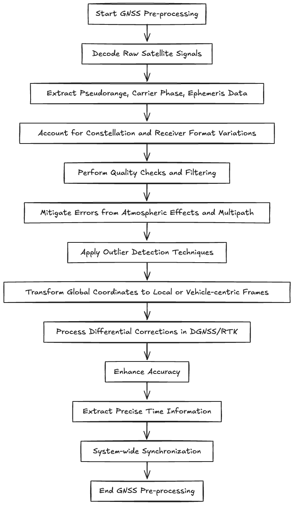
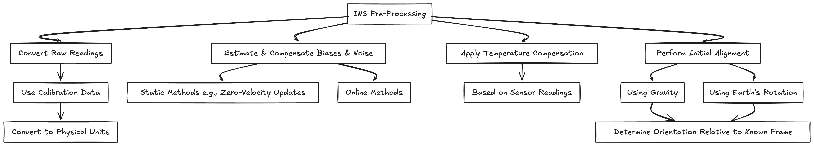

# GNSS/INS Data Pre-processing Design

## GNSS (Global Navigation Satellite System) Data Pre-processing

### Raw Measurement Decoding and Parsing

This involves taking the raw signals or messages from the GNSS receiver and extracting the essential information, such as pseudo-range measurements (the calculated distance between the receiver and each satellite), carrier phase measurements (the phase difference of the received signal compared to a locally generated signal), and satellite ephemeris data (information about the satellite’s orbit). Different GNSS constellations (US’s GPS, Russian’s GLONASS, EU’s Galileo, China’s BeiDou) and receiver manufacturers have their own specific data formats, which need to be correctly parsed.

### Quality Checks and Filtering

GNSS signals can be affected by various factors like atmospheric conditions (ionospheric and tropospheric delays), multipath effects (signals bouncing off surfaces), and satellite geometry. Pre-processing often includes checks for signal strength, satellite elevation, and the number of visible satellites. Outlier detection and filtering techniques (like Kalman filtering or simple moving averages) can be applied to mitigate noisy or erroneous measurements. For example, if pseudo-range measurement exhibits a sudden and significant jump that doesn’t correlate with other measurements, it might be flagged as an outlier and either discarded or down-weighted.

### Coordinate System Transformations

Raw GNSS measurements are typically referenced to a global coordinate system like WGS 84 (World Geodetic System 1984). Depending on the specific application within the AV, these global coordinates might need to be transformed into a local or vehicle-centric coordinate system. This involves applying mathematical transformations based on the vehicle’s initial pose or a defined local origin.

### Differential GNSS (DGNSS) and Real-Time Kinematic (RTK) Processing

If the system utilizes DGNSS or RTK for higher accuracy, the pre-processing stage handles the reception and application of correction data from a base station or a virtual reference station. This involves calculating differential corrections to reduce common-mode errors in the GNSS measurements, leading to significantly improved positioning accuracy.

### Time Synchronization

Accurate time synchronization is crucial in multi-sensor fusion. The GNSS receiver provides a highly accurate time reference, which needs to be extracted and potentially used to synchronize the timestamps of other sensors in the system.

## INS (Inertial Navigation System) Data Pre-Processing

### Raw Measurement Conversion

IMUs typically output raw data like accelerations (linear motion) and angular rates (rotational motion) along three axes. The pre-processing step involves converting these raw sensor readings (often in units like counts or raw voltage) into physical units (e.g., m/s^2 for acceleration and rad/s for angular rates) using calibration parameters specific to the IMU.

### Bias and Noise Estimation and Compensation

IMUs are susceptible to biases (constant offsets in the measurements) and noise. Pre-processing often involves techniques to estimate and compensate for these errors. This can include static calibration procedures performed before operation or online estimation methods that continuously refine bias estimated during vehicle motion. For instance, when the vehicle is stationary, the accelerometer readings should ideally be zero (ignoring gravity). Any non-zero reading represents a bias that can be estimated and subtracted from subsequent measurements.

### Temperature Compensation

The performance of IMUs can be sensitive to temperature variations. Some pre-processing pipelines include temperature sensors and apply compensations models to mitigate temperature-induced errors in the acceleration and angular rate measurements.

### Alignment

Before an INS can accurately provide orientation and position information, it needs to be properly aligned. This involves determining the initial orientation of the sensor frame relative to a known reference frame (e.g., the navigation frame). Pre-processing might include static alignment procedures that leverage gravity and Earth’s rotation to estimate the initial roll, pitch, and yaw angles.

---

Often, the pre-processing of GNSS and INS data is tightly integrated because combining these two sensor types provide significant advantages in terms of accuracy, robustness, and continuity of navigation information. Common integrated pre-processing techniques include:

### Kalman Filtering

[Explanation & Implementation](kalman.md)

This is a widely used technique to fuse noisy and potentially incomplete measurements from GNSS and INS to obtain an optimal estimate of the vehicle’s state (position, velocity, and orientation). The Kalman filter predicts the vehicle’s state based on the INS measurements and then corrects this prediction using the GNSS measurements when they are available.

### Error State Kalman Filtering (ESKF)

[Explanation & Implementation](eskf.md)

This is a common approach for GNSS/INS fusion where the filter estimates the errors in the INS-propagated state, which are then used to correct the INS and provide a more accurate and stable navigation solution.

---

In summary, the GNSS/INS data pre-processing is a vital first step in the autonomous vehicle’s perception pipeline. It ensures that the raw and often noisy data from these critical navigation sensors are transformed into a clean, consistent, and reliable stream of information that can be effectively used by higher-level functions like localization, mapping, and motion planning. By abstracting vendor-specific formats and performing essential data refinement, this layer contributes significantly to the overall robustness and accuracy of the autonomous driving system.