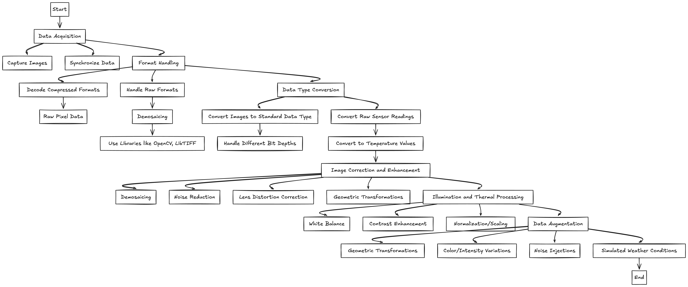

# Image Pre-processing Design

In autonomous driving, the ability to perceive the environment accurately and reliably is critical. This perception heavily relies on data from various sensors, with cameras being crucial. What are the data challenges?

- **Varied Data Formats**: JPEG, PNG, raw Bayer, TIFF
- **Different Bit Depths**: 8-bit/16-bit → affecting the range of color or intensity values
- **Sensor Noise**: Gaussian, salt-and-paper → degrading image quality
- **Illumination Variations**: day, night, shadows, glare →affecting image appearance
- **Weather Conditions**: rain, snow, fog → obscure visibility and distort images
- **Image Distortions**: radial, tangential distortion from the camera lenses → need correction
- **High Data Volume**: processing high-resolution images from multiple cameras in real-time requires significant computational resources
- **Different image type, Thermal**:
    - Lower resolution compared to RGB
    - Different information: temperature differences, not colors
    - Requires specific normalization

## Image Pre-processing

### Input Acquisition & Format Handling

- **Data acquisition**: Capturing images from RGB and thermal cameras → synchronize data streams from different sensors.
- **Format Decoding**: Decode compressed formates (e.g. JPEG, PNG) to raw pixel data and handle raw formats (e.g., Bayer) using demosaicing using OpenCV, LibTIFF and more.
- **Data Type Conversion**: Convert images to a standard data type (e.g., float32) for processing; handle different bit depths (8-bit/16-bit) appropriately; *for thermal images* → convert raw sensor readings to temperature values.

### Image Correction & Enhancement

- **Demosaicing (for raw RGB):** Interpolate missing color values in Bayer patterns to reconstruct the full RGB image via algorithms like bi-linear, lanczos.
- **Noise Reduction**: Reduce sensor noise using filters such as gaussian blur, median filter, bilateral filter, and non-local means; *consider adaptive filtering techniques that adjust to local image characteristics.*
- **Lens Distortion Correction**: Correct for radial and tangential distortions caused by lens imperfections (property of the camera) → using camera calibration parameters → `cv2.undistort` and `cv2.initCameraMatrix2D`.
- **Geometric Transformations:** Resize images for consistent input to downstream algorithms → crop images to a RoI to focus on relevant areas → warp images to correct for perspective distortions or align with other sensor data; *for thermal images, resizing might require careful interpolation to preserve temperature gradients.*

### Illuminating & Thermal Processing

- **White Balance (RGB)**: Adjust color balance to ensure objects appear neutral under different lightning conditions via algorithms like gray world, white patch, histogram equalization.
- **Contrast Enhancement (RGB & Thermal)**: Improve contrast to make objects more discernible → use CLAHE, gamma correction.
- **Normalization/Scaling:** Normalize pixel values to a specific range (e.g., 0-1) to improve the performance and stability of ML algorithms via Min-Max scaling, Z-score standardization. *In general, for normalization, try using 5-95% percentile normalization.*

### Data Augmentation

The purpose of data augmentation is to increase the diversity of the training data and improve the robustness of ML models and the techniques that follow are:

- Geometric transformations → rotation, translation, scaling, flipping
- Color/Intensity variations → brightness, contrast, saturation, hue adjustments
- Noise Injection → adding artificial noise
- Simulated weather conditions → applying filters or transformations to mimic rain, snow, or fog