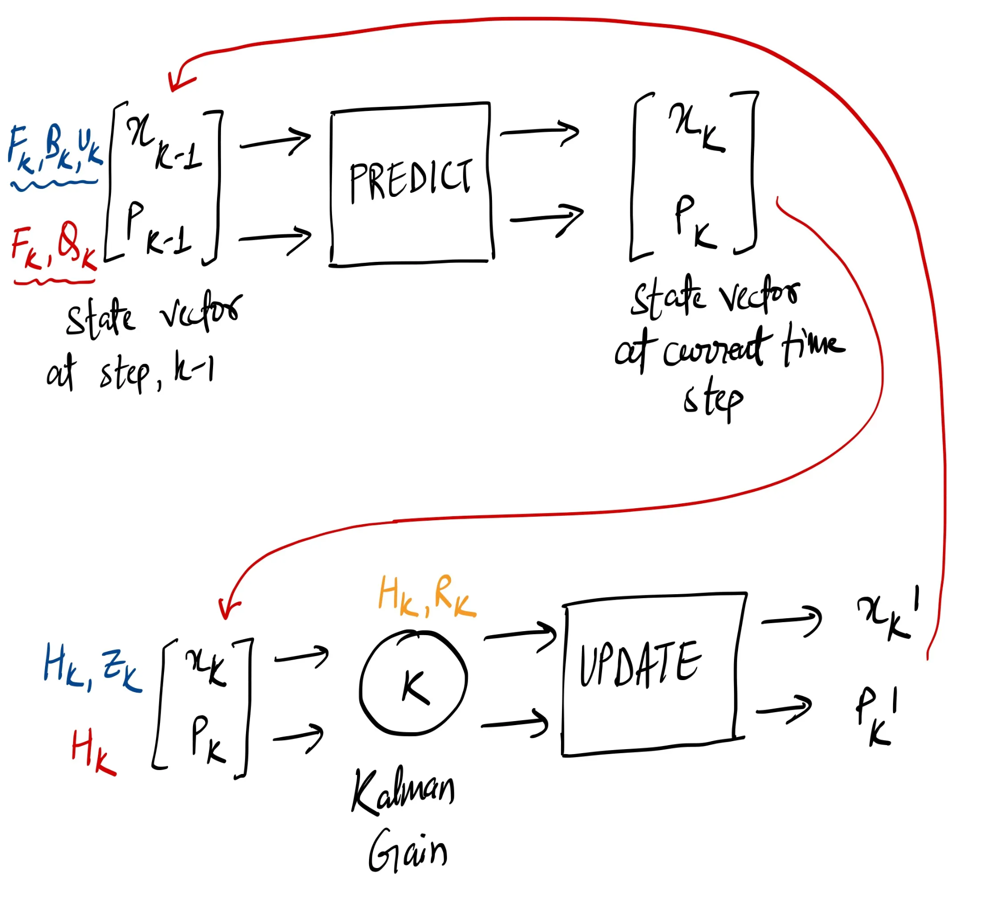

# Explanation & Implementation

Imagine your AV trying to figure out its exact position and velocity. It has sensors like GPS and IMU, but these sensors aren't perfect. GPS can be noisy and might not be available in tunnels, while IMU measurements can drift over time. The Kalman filter comes to the rescue as an optimal estimator that fuses these noisy sensor readings with a model of the system's dynamics to provide a more accurate estimate of the system's state. It has the advantage of being light on memory (doesn't need to keep any history other than the previous state), and it is very fast, making it well suited for real-time systems such as autonomous driving.

**Kalman Filter (recursive): Prediction → Update**

Let's consider 1-D motion of our vehicle to setup the system state and how our sensors update accordingly. 

- **State vector, $x_k$**: The vector consists of the variables we want to update at time step $k$. For our 1-D example, it includes position ($p$) and velocity ($v$). Please note that the state vector is just a list of numbers about the configuration of the system at hand.

$$
x_k = \begin{bmatrix} p_x \\ v_x \end{bmatrix}
$$

> We don't know what the actual position and velocity are; there can be a whole range os possibilities but some of them are more likely than others. For the Kalman filter, we can assume that both the state variables (position and velocity) are randomly distributed (Gaussian). Thus, each variable has a mean, and a variance (which is the uncertainty here). Please note that the position and velocity will be correlated as we estimate next steps. **How would you capture correlation? A covariance matrix!**

- **Correlation matrix**, $P_k=Covariance(x)$: This matrix captures the uncertanty of the state vector.

$$P_k = \begin{bmatrix} \sum_{pp} &  \sum_{pv} \\ \sum_{vp} & \sum_{vv} \end{bmatrix}$$

- **Process Model, $F_k$**: This matrix describes how the state evolves from time step $k-1$ to $k$ in the absence of any measurements. Assuming a constant velocity model over a small time step $\Delta t$,

$$F_k = \begin{bmatrix} 1 & \Delta t \\ 0 & 1 \end{bmatrix}$$

So, the predicted state is, 
$$x_{k|k-1} = F_k x_{k-1|k-1} + u_k$$
where $u_k$ is the process noise. Now, we have a prediction matrix which gives us our next state, but we still don't know how to update the covariance matrix.

$$x_{k|k-1} = F_k x_{k-1|k-1}; P_k = F_k P_{k-1}F^T_k$$

> Till now, we have discussed about the intrinsics, what about the external influences and uncertainty—**how the outside world can affect our system?**

Let's say we know the expected acceleration $a$ due to the throttle setting or control commands. From basic kinematics, we get,

$$p_x = p_{k-1}+\Delta tv_{k-1}+0.5*a\Delta t^2; v_x = v_{k-1}+a\Delta t$$

In matrix form, 
$$x_{k|k-1} = F_kx_{k-1|k-1}+\begin{bmatrix}\Delta t^2/2 \\ \Delta t \end{bmatrix}a = F_kx_{k-1|k-1} + B_kU_k$$

$B_k$ is the control matrix and $U_k$ is the control vector, altho for very simple systems we can ignore these. Now, one last thing is that the process model is not perfect; there are always unmodeled disturbances and uncertainties. We represent this as process noise $w_k$, which is assumed to be a zero-mean Gaussian random variable with covariance matrix $Q_k$: $w_k \approx N(0, Q_k)$. For our 1-D example, $Q_k$ might look like,

$$Q_k = \begin{bmatrix}\sigma_p^2 & 0 \\ 0 & \sigma_v^2\end{bmatrix}$$

Now, our complete prediction step looks like, 

$$x_{k|k-1} = F_k x_{k-1|k-1}+B_kU_k; P_{k|k-1} = F_k P_{k-1|k-1}F^T_k + Q_k$$

> In other words, the new best estimate is a prediction made from previous best estimate, plus a correction for unknown external influences.

We have a fuzzy estimate of where our 1-D system might be, given by $x_k$ and $p_x$, let's get some data from our sensors!

### How to refine estimates with sensor data measurements?

- **Measurement Model,** $H_k$: Let's model the sensor with this matrix, it describes how our measurements $z_k$ are related to the stste vector $x_k$. The expected measurement is, $z_k = H_kx_k+v_k$; where $v_k$ is the measurement noise and represented by the covariance matrix $R_k$(matrix capturing the variances and covariances of their noise).

As we have already estimated out prediction step, let's break it down anyway here.

## **Kalman Filter Algorithm**



### **Prediction Step (Time Update)**

- **Predict the state estimate**: Using the system model, we project the previous state estimate 
$$x_{k-1|k-1}$$ 
to the current time step:

$$x_{k|k-1} = F_k x_{k-1|k-1}+B_kU_k$$

- **Predict the error covariance**: We also predict the error covariance matrix 
$$P_{k-1|k-1}$$
of the previous state estimate, which represents the uncertainty in our previous state estimate, to the current time step:

$$P_{k|k-1} = F_k P_{k-1|k-1}F^T_k + Q_k$$

### Update Step (Measurement Update)

- **Compute the Kalman Gain**, $K_k$: This determines how much weight to give to the new measurement versus the prediction, depends on the uncertainties in both the prediction and the measurements:

$$K_k = P_{k|k-1}H^T_k(H_kP_{k|k-1}H^T_k+R_k)^{-1}$$

In simple terms, what happens when two Gaussians interact? What's the new mean and new variance? 

$$\mu^{'} = \mu_0 + \sigma_o^2(\mu_1-\mu_0)/(\sigma_0^2+\sigma_1^2);\sigma^{'2}=\sigma_0^2 - \sigma_0^4/(\sigma_0^2+\sigma_1^2)$$

where $k = \sigma_0^2/(\sigma_0^2+\sigma_1^2)$, and hence,

$$\mu^{'} = \mu_0+k(\mu_1-\mu_0); \sigma^{'2}=\sigma_0^2-k\sigma_0^2$$

In matrix form, 
$$K = \sum_0(\sum_0+\sum_1)^{-1}$$

- **Update the state estimate**: We correct the predicted state estimate using the actual measurement $z_k$ and the Kalman gain,

$$x_{k|k} = x_{k|k-1}+K_k(z_k-H_kx_{k|k-1})$$

- **Update the error covariance**: We also update the error covariance matrix to reflect the incorporation of the new measurement:

$$P_{k|k}=(I-K_kH_k)P_{k|k-1}$$

```python
import numpy as np

class KalmanFilter1D:
    def __init__(self, dt, process_noise_var_p, process_noise_var_v, measurement_noise_var):
        self.dt = dt

        # State: [position, velocity]
        self.x = np.zeros((2, 1))
        # State covariance matrix
        self.P = np.eye(2)

        # Process model
        self.F = np.array([[1, dt],
                           [0, 1]])
        # Process noise covariance
        self.Q = np.array([[process_noise_var_p * dt**3 / 3, process_noise_var_p * dt**2 / 2],
                           [process_noise_var_p * dt**2 / 2, process_noise_var_v * dt]])

        # Measurement model (only measuring position)
        self.H = np.array([[1, 0]])
        # Measurement noise covariance
        self.R = np.array([[measurement_noise_var]])

    def predict(self, u=0):
        # Predict state
        self.x = self.F @ self.x  # Assuming no control input
        # Predict covariance
        self.P = self.F @ self.P @ self.F.T + self.Q
        return self.x

    def update(self, z):
        # Innovation
        y = z - self.H @ self.x
        # Innovation covariance
        S = self.H @ self.P @ self.H.T + self.R
        # Kalman gain
        K = self.P @ self.H.T @ np.linalg.inv(S)
        # Update state
        self.x = self.x + K @ y
        # Update covariance
        self.P = (np.eye(self.P.shape[0]) - K @ self.H) @ self.P
        return self.x
```