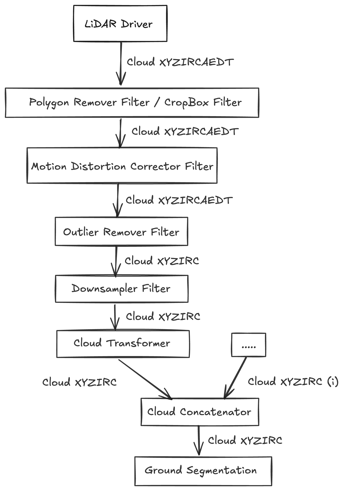

# Point Cloud Pre-processing Design

| Name | Data Type | Derived | Description |
| --- | --- | --- | --- |
| X | `float32` | `false` | X position |
| Y | `float32` | `false` | Y position |
| Z | `float32` | `flase` | Z position |
| I (intensity) | `uint8` | `flase` | Measured reflectivity, intensity of the point |
| R (return type) | `uint8` | `flase` | Laser return type for dual return lidars |
| C (channel) | `uint16` | `flase` | Channel ID of the laser that measured the point |
| A (azimuth) | `float32` | `true` | `atan2(Y,X)`, Horizontal angle from the lidar origin to the point |
| E (elevation) | `float32` | `true` | `atan2(Z,D)`, Vertical angle from the lidar origin to the point |
| D (distance | `float32` | `true` | `hypot(X,Y,Z)`, Euclidean distance from the lidar origin to the point |
| T (time) | `uint32` | `flase` | Nanoseconds passed since the time of the header when this point was measured |

## Input Acquisition & Synchronization

This stage handles the raw data stream from one or multiple LiDAR sensors and we should be able to process different LiDAR data formats (e.g., point clouds in `.pcd`, `.pcd`, or proprietary formats.

- **Timestamping and Synchronization**
- **Data Buffering:** Temporarily storing incoming data can help manage varying data rates and ensure smooth processing.

## Filtering

- **Noise Filtering**: Removing spurious or noisy points that don’t represent the environments—could involve statistical outlier removal (*identify and filter points whose average distance to their neighbors is outside a defined standard deviation threshold*), radius outlier removal (*eliminates points that have a fewer than a certain number of neighbors within a specified radius*), or density-based filtering.
- **Range Filtering**: Removing points outside a defined minimum and maximum range, which can be useful for focusing on the relevant environment and eliminating distant noise.
- **Intensity Filtering**: Filtering points based on their intensity values, which can help in distinguishing different surface properties or removing points with unreliable intensity readings.
- **RoI Filtering**: Focusing processing on a specific area of the point cloud relevant to the vehicle’s surroundings → reducing significant computational load.

## Coordinate Transformation & Calibration

- **Sensor Calibration**: Apply calibration parameters to correct for sensor imperfections and ensure accurate point measurements: intrinsic (within the sensor) and extrinsic (relative to the vehicle frame) calibration.
- **Coordinate System Transformation:** Transforming the point cloud into a common coordinate frame (e.g., the vehicle’s ego frame) to facilitate sensor fusion and downstream processing (involves applying rotation and translation matrices).

## Point Cloud Enrichment

- **Ground Plane Segmentation**: Identify and remove/isolate the ground plane as shown in the above figure as well → simplify object detection and free-space estimation. *Methods: RANSAC-based plane fitting or learning-based methods.*
- **Clustering and Segmentation**: Group points that likely belong to the same object based on spatial proximity, color (optional), or other features. *Methods: k-means, [DBSCAN](https://www.geeksforgeeks.org/dbscan-clustering-in-ml-density-based-clustering/), or region growing.*
- **Feature Extraction**: Compute features for each point or cluster, such as normals, curvatures, or local descriptors. *Methods: PointNet/PointNet++*

## Downsampling (for efficiency)

- **Voxel Grid Downsampling**: Reduce the intensity of the point cloud by replacing points within each voxel (3D grid cell) with a representative point i.e., the centroid OR random downsampling where we randomly select a subset of the points.