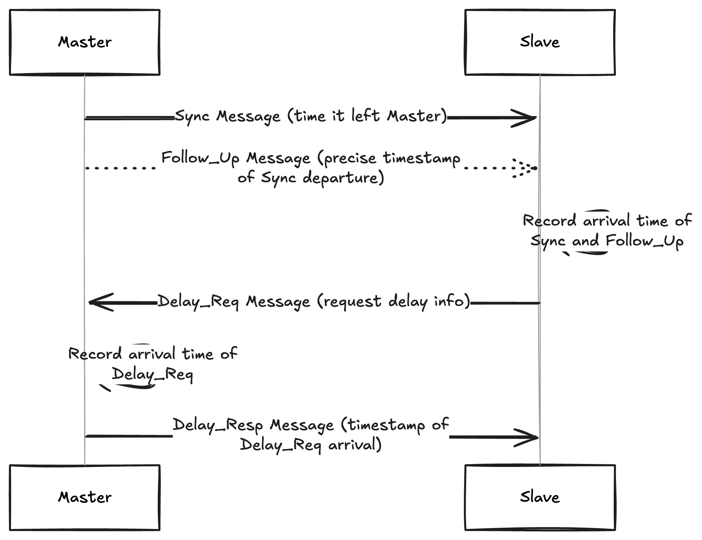

# Synchronization

Precision Time Protocol (PTP) — network protocol designed to synchronize clocks in a computer network with extremely high accuracy (~ nanosecond range): master-slave hierarchy + sophisticated message exchange mechanism (accounting for network delays). 

PTP:

- **Sync Message**: The master clock sends a Sync message containing the time it left the master.
- **Follow_Up Message**: (In two-step mode) Immediately after the Sync message, the master sends a Follow_Up message containing the precise timestamp the Sync message actually left the master’s port. This accounts for internal delays in the master device.
- **Delay_Req Message**: The slave receives the Sync (and Follow_Up) message and records the arrival time. It then sends a Delay_Req message to the master.
- **Delay_Resp Message**: The master receives the Delay_Req message and sends a Delay_Resp message back to the slave containing the timestamp the Delay_Req message arrived at the master.

By exchanging these messages and recording precise timestamps at both the master and slave ends, the slave clock can calculate the network delay and the offset between its clock and the master’s clock — this allows the slave to adjust its own clock to synchronize with the master with high accuracy.

Challenges while implementing in autonomous vehicles software systems:

- **Network Infrastructure**: Achieving high PTP accuracy relies on the underlying network infrastructure. Network switches and other devices need to be PTP-aware (supporting transparent or boundary clock functionalities) to minimize timing errors introduced by packed delays.
- **Hardware Support**: End devices, including sensors and processing units, require hardware support for precise time-stamping to leverage the full accuracy of PTP
- **Profile Compatibility**: Ensuring that all devices in the vehicle’s network use compatible PTP profiles is crucial for successful synchronization
- **Robustness**: The synchronization system must be robust to potential network issues and component failures, which is critical for safety-critical automotive applications.